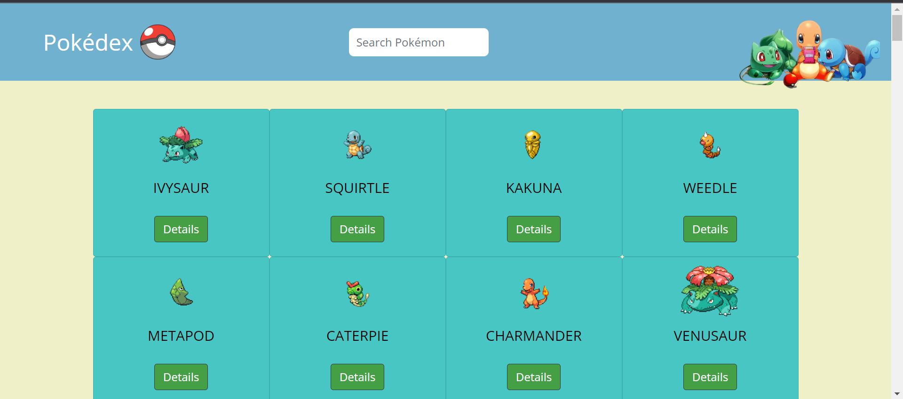

# Pokédex App

## Overview

This Simple Pokédex App is a web application built using HTML, CSS, and JavaScript. It allows users to browse and search for information about various Pokémon, including their names, images, types, and abilities. This readme file provides instructions on how to use and set up the application.

## Description

- A small and simple web application made with HTML, CSS, and JS
- Ioads data from an external API and enables the viewing of data (Pokemons) in detail
- The main purpose of this app is to employ newly learned ways of dealing with JS code

## Key Features

- Browse through a list of Pokémon
- Search for specific Pokémon by name
- Load data from an external source (API)
- View all loaded Pokemon placed on cards and on a responsive webpage
- The cards include a button to enable viewing of more details about the Pokemon
- Live search/filter for the loaded Pokemons
- All dependencies are included in the code
- Bootstrap 4.3.1 is used for the user interface elements
- The PokeAPI is used by the project

## Code quality and performance

- Javascript Minifier is used to decrease its file size
- Performance was checked with Chrome developer tools
- ESLint was used for code quality
- The app was tested on different screen sizes with Chrome developer tools

## Getting Started

1. Clone the repo
   ```sh
   git clone https://github.com/RemanBalak/pokedex-app.git
   ```
2. Open the project folder
   ```sh
   cd pokedex-app
   ```
3. Run the App

Open the index.html file in your web browser to run the application.

## Usage

Once you have the application running, you can use it as follows:

1. Browsing Pokémon

- Upon opening the app, you will see a list of Pokémon. Scroll down to view more Pokémon.
- Click on a Pokémon card to view more details about that specific Pokémon.

2. Searching for Pokémon

- Use the search bar at the top of the page to search for Pokémon by name.
- Type the name and the page will load the results automatically.

3. Viewing Pokémon Details

- When you click on a Pokémon card, a modal will pop up with more details about the selected Pokémon.
- The modal will display the Pokémon's name, image, type(s), abilities, and additional information.

## Acknowledgments

This project was created as a learning exercise in web development.
Pokémon data is sourced from the Pokémon API, and the application structure and design are inspired by various Pokédex apps and websites.

Thank you for using the Simple Pokédex App! If you have any questions or encounter any issues, please don't hesitate to reach out to me.

## Project Links

Live Project: [https://remanbalak.github.io/pokedex-app/](https://remanbalak.github.io/pokedex-app/)

## Screenshots


